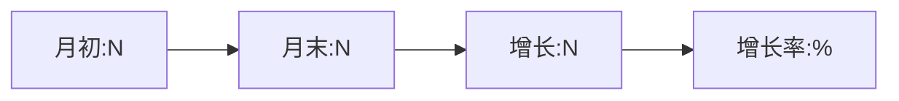

# 月度战略分析报告

> 使用时间：每月1日
> 执行Agent：CEO Agent + 复盘Agent

---

```yaml
month: {YYYY-MM}
type: 月度复盘
status: "待填写"
```

## 一、月度数据总览

| 指标 | 本月 | 上月 | 环比 | 目标达成率 |
|------|------|------|------|-----------|
| 发布数 |  |  |  | % |
| 总阅读量 |  |  |  | % |
| 总互动量 |  |  |  | % |
| 平均互动率 |  |  |  | % |
| 总粉丝增长 |  |  |  | % |
| 爆款数(>1w) |  |  |  | - |
| 总粉丝数 |  |  |  | % |
| 私域新增 |  |  |  | % |
| 收入 |  |  |  | % |

## 二、内容质量分析

### 互动率分布
- 高互动(>10%)：{N}篇
- 中等互动(5-10%)：{N}篇
- 低互动(<5%)：{N}篇

### 最佳内容排行榜
1. {标题} - {互动率} - {成功因素分析}
2. {标题} - {互动率} - {成功因素分析}
3. {标题} - {互动率} - {成功因素分析}

## 三、用户增长分析

### 粉丝增长趋势


### 粉丝画像变化
- 新增粉丝特征与原有画像匹配度：{高/中/低}
- 粉丝活跃度变化：{上升/持平/下降}

## 四、竞品动态

### 领域内重要变化
1. {变化1} - {影响分析}
2. {变化2} - {影响分析}

### 新出现的竞品/机会
- 
- 

## 五、品牌定位评估

### 定位一致性检查
- 内容方向与定位匹配度：{评分1-5}
- 用户认知是否与定位一致：{评分1-5}
- 差异化是否持续有效：{评分1-5}

### 是否需要调整
- [ ] 定位需要微调
- [ ] 内容方向需要优化
- [ ] 目标用户需要重新聚焦

## 六、商业模式进展

| 项目 | 进度 | 收入 | 下一步 |
|------|------|------|--------|
| 免费产品 |  |  |  |
| 付费产品 |  |  |  |
| 私域运营 |  |  |  |
| 其他变现 |  |  |  |

## 七、问题与挑战

### 主要问题
1. {问题} - {严重程度} - {可能解决方案}
2. {问题} - {严重程度} - {可能解决方案}

### 风险预警
- {风险描述}

## 八、下月规划

### 目标设定
```yaml
goals:
  content: 
    publish_count: 
    target_reads: 
    target_engagement: 
  growth:
    target_followers: 
    target_private_domain: 
  business:
    revenue_target: 
    product_launch: 
```

### 关键行动项
1. {行动项} - 负责人：{Agent/Creator} - 截止日期：{}
2. {行动项} - 负责人：{Agent/Creator} - 截止日期：{}

### 资源需求
- 
- 

## 九、季度展望

### 本季度目标回顾
| 目标 | 进度 | 状态 |
|------|------|------|
|  |  | 🟢/🟡/🔴 |

### 重点方向
1. 
2. 
3. 

---

*生成时间：{YYYY-MM-DD}*
*下次月度复盘：{YYYY-MM-DD}*
